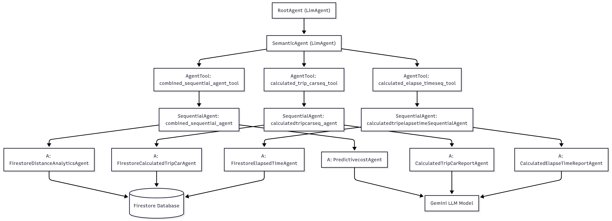

# Mobile Ads Analytics Agent

This repository contains a Python-based analytics agent for mobile ads, built on **Google ADK (Agents & Tools)** and **Firestore**. The agent processes car-related telemetry data to compute fuel costs, driver costs, trip statistics, and elapsed time, returning structured JSON or textual results suitable for visualization and reporting.

---

## Overview

`agent.py` defines multiple **specialized agents**, **sequential agents**, and **tools** to handle various analytics scenarios. It integrates with Firestore to retrieve historical data and uses LLMs to calculate and format the results.

The system supports the following high-level workflows:

1. Fetch route and distance data from Firestore.
2. Calculate predictive costs (fuel, driver) per trip or per leg.
3. Count trips and compute elapsed time for each car.
4. Handle complex queries comparing multiple cars.
5. Provide structured JSON suitable for dashboards or Plotly visualizations.

---

## Environment Setup

Set the following environment variables:

Install dependencies:

```bash
pip install google-cloud-firestore google-adk google-genai requests

/home# source .venv/bin/activate
/home# adk api_server agents
```


## Key Agents & Tools
| Agent / Tool                      | Purpose                                                                                                          |
| --------------------------------- | ---------------------------------------------------------------------------------------------------------------- |
| `FirestoreDistanceAnalyticsAgent` | Retrieves all legs for a given car from the latest Firestore collection, returning `from`, `to`, and `distance`. |
| `PredictivecostAgent`             | Computes predictive costs (fuel/driver) based on Firestore distance data.                                        |
| `FirestoreCalculatedTripCarAgent` | Counts how many trips a specific car has driven based on Firestore collections.                                  |
| `CalculatedTripCarReportAgent`    | Formats and returns the number of trips from `FirestoreCalculatedTripCarAgent`.                                  |
| `FirestoreElapsedTimeAgent`       | Computes elapsed time from the first to the latest position of a car.                                            |
| `CalculatedElapseTimeReportAgent` | Formats and returns elapsed time from `FirestoreElapsedTimeAgent`.                                               |

Sequential Agents combine multiple agents for stepwise processing:

| Sequential Agent                    | Sub-agents                                                        | Description                                                             |
| ----------------------------------- | ----------------------------------------------------------------- | ----------------------------------------------------------------------- |
| `combined_sequential_agent`         | `[FirestoreDistanceAnalyticsAgent, PredictivecostAgent]`          | Fetch Firestore distance data, then compute predictive costs using LLM. |
| `calculatedtripcarseq_agent`        | `[FirestoreCalculatedTripCarAgent, CalculatedTripCarReportAgent]` | Count trips, then format the report.                                    |
| `calculatedtripelapsetimeseq_agent` | `[FirestoreElapsedTimeAgent, CalculatedElapseTimeReportAgent]`    | Compute elapsed time, then format the report.                           |


Tools wrap agents for easy invocation:


- combined_sequential_agent_tool
- calculated_trip_carseq_tool
- calculated_elapse_timeseq_tool

Semantic / Root Agents
SemanticAgent: Main LLM agent that interprets user queries and decides which tool/agent to invoke.

RootAgent: Top-level coordinator; greets the user and delegates analytics queries to the SemanticAgent.

## Query Scenarios
The agent supports several predefined query patterns:

| Scenario        | Example Query                                                                                       | Behavior                                                                        |
| --------------- | --------------------------------------------------------------------------------------------------- | ------------------------------------------------------------------------------- |
| 1. Fuel Cost    | "Calculate all fuel cost for car1 if predictive cost per meters is 1 USD"                           | Runs `combined_sequential_agent` with `{ id: carId, userquery: query }`.        |
| 2. Driver Cost  | "Calculate all professional driver cost for car2 if predictive cost per 10 meters is 1 USD"         | Runs `combined_sequential_agent`.                                               |
| 3. Compare Cars | "Calculate total cost of fuel for car2 at 2 USD per 1000m and compare with car1 at 3 USD per 2000m" | Splits query per car, runs `combined_sequential_agent` twice, compares results. |
| 4. Trip Count   | "How many trips has car1 driven?"                                                                   | Uses `calculated_trip_carseq_tool` to count collections.                        |
| 5. Elapsed Time | "Elapsed time for car1 latest trip"                                                                 | Uses `calculated_elapse_timeseq_tool`.                                          |
| 6. Graph Data   | "Total fuel cost for car1 latest trip with x/y points per leg"                                      | Returns JSON array of coordinates suitable for Plotly graphs.                   |

## Firestore Structure

Collections per car: <carId>_coll_<timestamp>

Leg documents: Contain from, to, and distance fields.

Latest positions: cars_latest_position collection, structured with documents per trip and subcollections positions.


